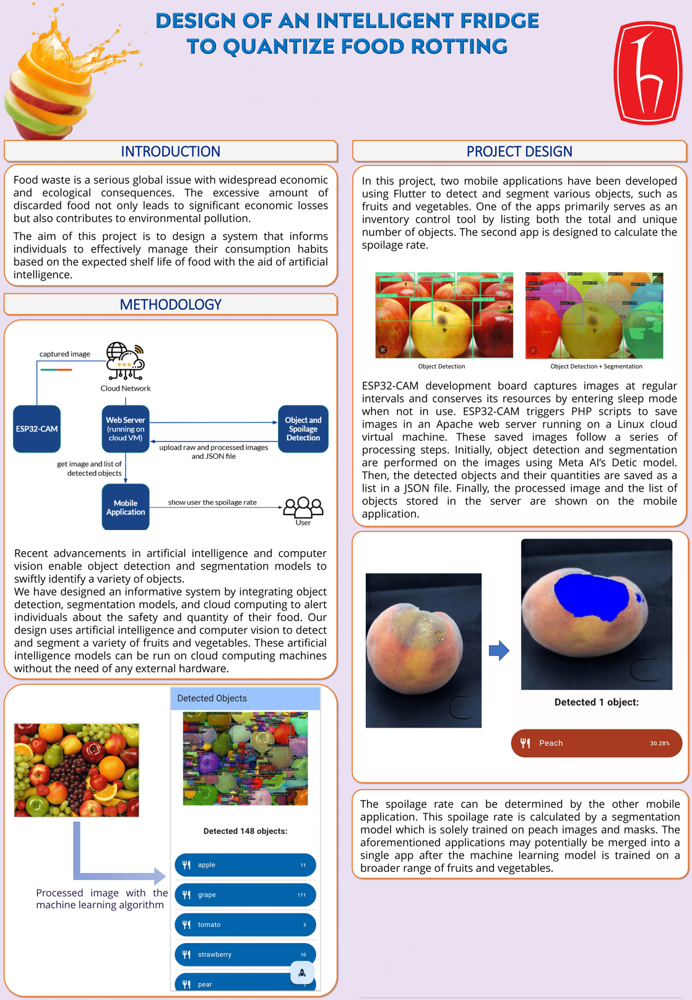

# Smart Fridge to Quantise Food Decay

Graduation project - Fall 23/24
  
## How to setup

    mkdir cyber_chill
    cd cyber_chill
    git clone https://github.com/darkquesh/cyber-chill-unit.git
    git clone https://github.com/darkquesh/Detic.git

## Tools and Environments Used

- Development Board
  - ESP32-CAM (with OV2640 camera)
- Machine Learning (object detection and segmentation)
  - PyTorch
  - Detic
- App Development
  - Flutter, Dart
  - Android Studio
- Web Development
  - Apache
  - Google Cloud Platform
  - Ubuntu Linux virtual machine

  

## References

- darkquesh. (n.d.). darkquesh/Detic: Code release for “detecting Twenty-thousand classes using image-level supervision”. GitHub. <https://github.com/darkquesh/Detic>

- canatess. (n.d.). canatess/Smart-Fridge. GitHub. <https://github.com/canatess/smart-fridge>
